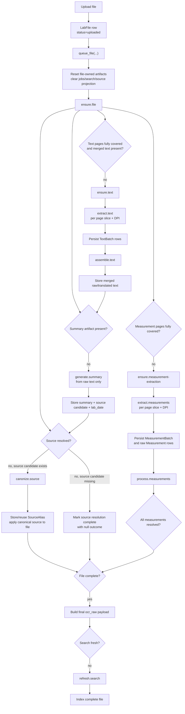
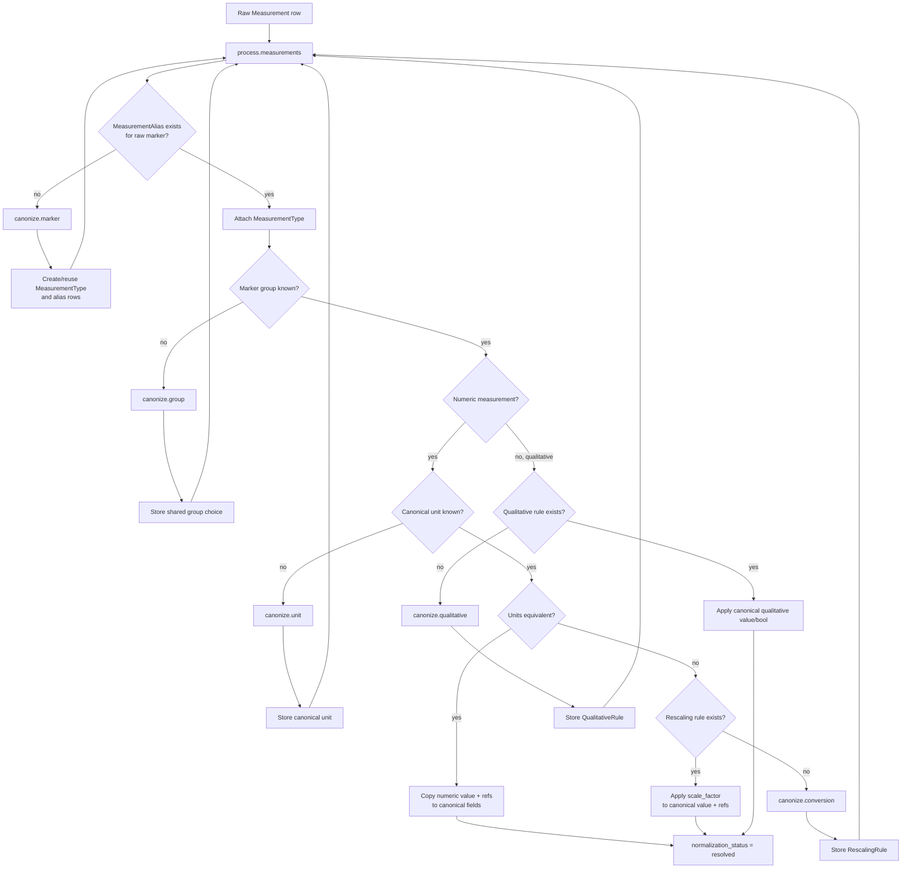
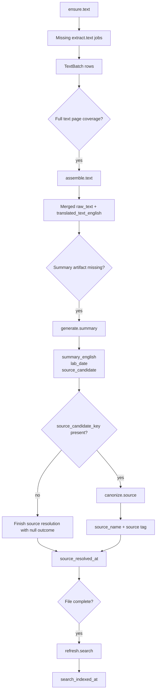
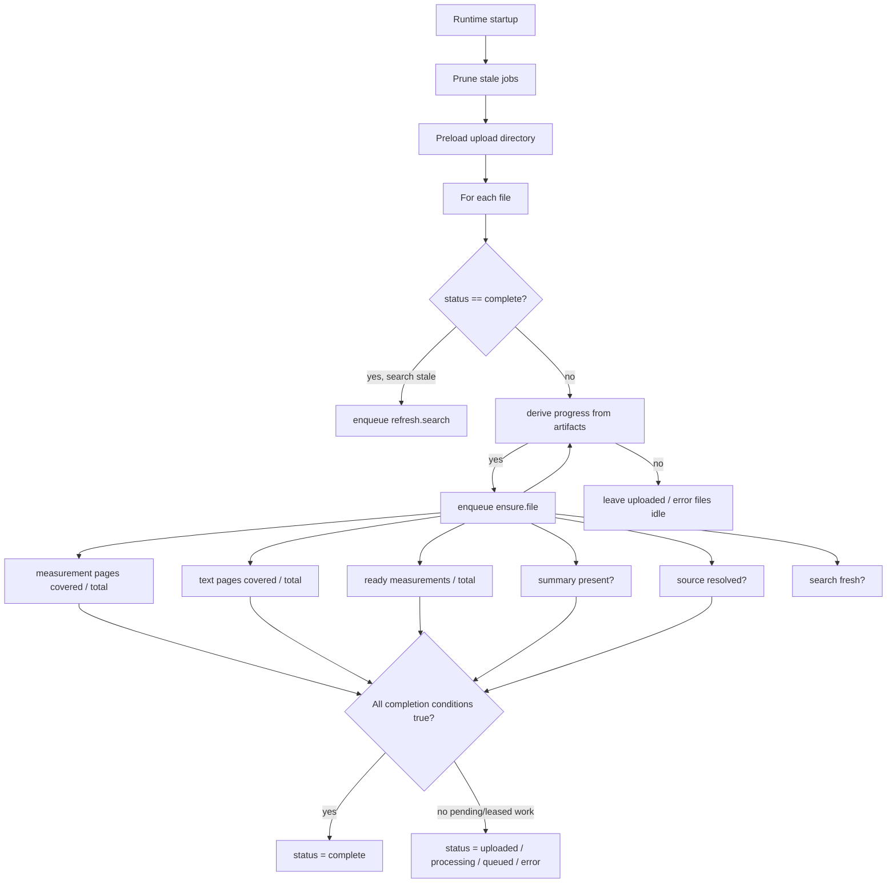
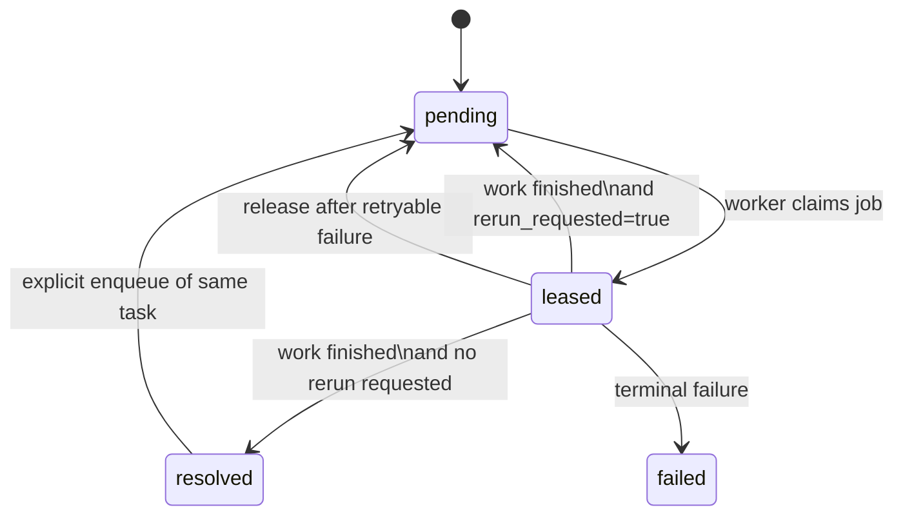

# Artifact-first lab pipeline

This document describes the **current** job system and pipeline state after the artifact-first rewrite.

For a broader docs map, start with [`docs/README.md`](./README.md). The old reconcile/publish design lives in [`legacy-queue-backed-ocr-request-flow.md`](./legacy-queue-backed-ocr-request-flow.md) and is historical background only.

It replaces the old `reconcile` / `publish` / `READY` design with:

- durable batch artifacts for measurement OCR and text OCR
- a top-level `ensure.file` controller that derives missing work from stored artifacts
- measurement-level visibility once a measurement is individually resolved
- text-driven summary generation
- completion-gated search refresh
- rerun-while-leased job semantics, with normalization lanes serialized by worker topology
- persistent canonical artifacts for markers, groups, units, conversions, qualitative values, and sources
- anomalous-rescaling review jobs for suspicious numeric conversions

## 1) High-level job graph

## 2) Measurement processing and canonization

`process.measurements` is the only job that makes measurements visible. Canonization jobs only create shared canonical artifacts, then re-request processing.

Canonization is the step that turns OCR-local fields into shared, reusable data:

- `MeasurementAlias` maps raw marker names to a canonical `MeasurementType`
- `MeasurementType` stores the canonical marker name, group, and canonical unit
- `MarkerGroup` keeps biomarker grouping stable across the UI
- `RescalingRule` stores reusable numeric conversion factors for a biomarker and unit pair
- `QualitativeRule` stores reusable canonical text/boolean mappings for qualitative results

Once those rows exist, later files hit the database first and often skip new model work entirely.

Numeric unit conversion can add one extra review loop before a measurement settles. When a rescaled value lands far outside the marker's historical envelope, `process.measurements` can either apply a deterministic corrective factor immediately or queue `review.anomalous-rescaling`. That review lane batch-processes suspicious conversions, stores the chosen factor (or an explicit no-change result), and re-requests `process.measurements`.

Automatic conversion follows a strict order:

1. normalize the original and canonical unit keys
2. if the units are equivalent, copy the numeric value and reference range directly into canonical fields
3. otherwise, reuse an existing `RescalingRule` or queue `canonize.conversion` to learn one
4. apply the scale factor to the value and reference range together
5. if the converted result still looks implausible against resolved history, apply a deterministic correction when possible or queue `review.anomalous-rescaling`

## 3) Text, summary, source, and search lane

`canonize.source` plays the same reuse game as marker canonization: it stores `SourceAlias` rows so recurring source strings can resolve to a canonical source name without redoing the whole decision each time.

## 4) Controller, completeness, and startup self-healing

The pipeline does not depend on a final stamped `READY` state. Instead, completeness is derived from artifacts.

The file is treated as complete when:

- measurement extraction has full page coverage
- text extraction has full page coverage
- merged text exists
- summary generation has completed
- source resolution has completed (including an explicit null outcome)
- every measurement is resolved and no measurement errors remain

Startup only auto-resumes files that were already scheduled before the restart: files in `queued` / `processing`, or files that still have an active file-scoped job. Plain `uploaded` and `error` files stay idle until explicitly requeued.

## 5) Job semantics

The job table now supports idempotent enqueue **and** in-flight re-request.

- Every logical job keeps a stable `(task_type, task_key)`.
- Re-enqueue while leased sets `rerun_requested=true` instead of creating duplicate rows.
- Terminal failed jobs are not auto-revived by controller requests; an explicit file reset/requeue clears and recreates the needed work.
- Common canonization jobs run each claimed batch in a fresh DB session, so the claim transaction and the canonization transaction stay separate.
- Normalization lanes are serialized by running one worker per lane, so only one claimed batch for that lane can run at a time.
- Startup lease recovery and stale job pruning keep the system self-healing after shutdowns.

### Worker-loop batching model

- Worker loops that currently claim and process **one job row at a time**:
  - `ensure.file`
  - `ensure.measurement-extraction`
  - `ensure.text`
  - `extract.measurements`
  - `extract.text`
  - `assemble.text`
  - `process.measurements`
  - `generate.summary`
  - `refresh.search`
  - `canonize.source`

- Worker loops that currently claim and process **multiple job rows in one batch**:
  - `canonize.marker`
  - `canonize.group`
  - `canonize.unit`
  - `canonize.conversion`
  - `canonize.qualitative`
  - `review.anomalous-rescaling`

- For those batchable normalization/review lanes, one worker claims multiple job rows into a single batch session and may call the LLM on that combined batch. The lane still keeps `concurrency = 1`, so only one batch for that lane can run at a time.
- Those lanes now use the same handler path for `1..N` claimed jobs; they do not keep separate single-job handler variants.

## 6) API / UI projections

The API no longer exposes old per-stage file columns as pipeline truth.

- `LabFileOut` exposes derived artifact progress:
  - measurement pages done / total
  - text pages done / total
  - ready measurements / total
  - summary ready
  - source ready
  - search ready
  - completeness
- Measurement endpoints expose only `Measurement.normalization_status == resolved`.
- File detail and file list views render progress from those derived facts rather than from old stage enums.
- Biomarker views, exports, and search snippets consume canonical marker names, canonical units, converted numeric values, and normalized qualitative values rather than raw OCR tokens.
- Supported uploads include PDF/image files plus `.txt`/`.md`; text documents behave as single-page text sources for preview, export, and share bundles.
- Search indexes complete files across filename, tags, summary, raw text, translated text, and measurement text.
- Share export builds a read-only HTML snapshot from sanitized file projections, page/text previews, measurement data, biomarker views, and search documents; uploads, reprocessing, admin actions, and generated summaries are intentionally disabled there.

## 7) Why `pipeline.py` is large

The current `pipeline.py` is large because it owns five tightly related concerns in one place:

1. runtime worker registration and lease handling
2. controller jobs (`ensure.*`)
3. extraction persistence and coverage logic
4. measurement processing / canonization orchestration
5. file completeness + search freshness projection

That size is understandable for the first cut because all of those pieces are coupled by the artifact-first state machine.

The clearest future split points are:

- `pipeline_runtime.py` for worker startup / loop / failure policy
- `pipeline_extraction.py` for coverage, batch persistence, and fallback splitting
- `pipeline_measurements.py` for `process.measurements` plus `canonize.*`
- `pipeline_progress.py` for derived file progress and search freshness helpers

The current shape is acceptable, but those are the natural boundaries if the file grows further.
