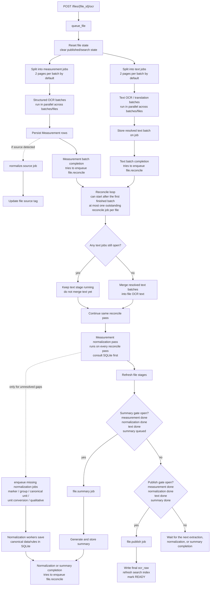
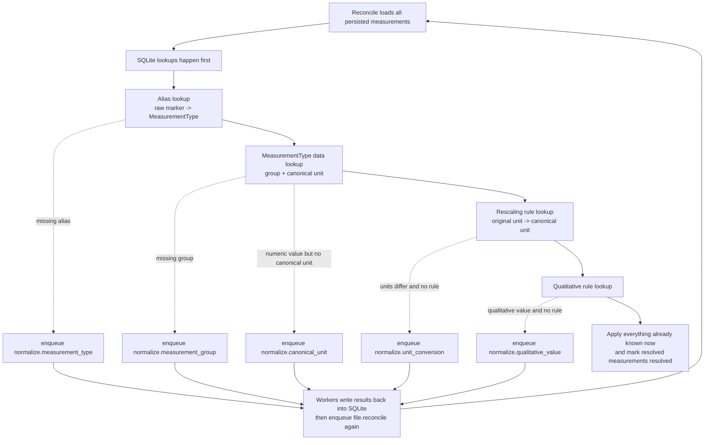
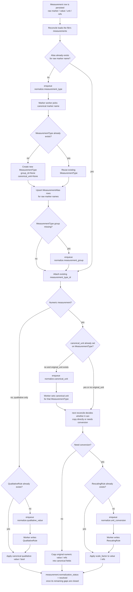

# Queue-backed OCR request flow

This version separates the explanation into two smaller views:

1. how a file is split into durable job families, and what each later stage depends on
2. what reconcile does during normalization, including the point where it consults SQLite before it queues any normalization jobs

## 1) Split and stage dependencies

## 2) Normalization inside reconcile: DB lookup first

Reconcile also checks existing normalization job state while doing these lookups, so a prior failed normalization job can surface as an error instead of being re-enqueued forever.

## 3) Measurement normalization lifetime for one measurement

### What this means in practice

- A `Measurement` row is created first with raw OCR fields. At that point it does **not** yet know its `measurement_type_id`, canonical unit, canonical value, or normalized qualitative value.

- A new `MeasurementType` can be created only in the `normalize.measurement_type` worker, not during OCR persistence.
  - The worker first asks Copilot whether the raw marker name should map to an existing canonical marker or a new one.
  - If the chosen canonical marker name does not exist yet, `_ensure_measurement_types(...)` creates a new `MeasurementType` row with `group_id=None` and `canonical_unit=None`.
  - The worker then upserts `MeasurementAlias` rows so future reconciles can attach raw marker names directly to that type without asking Copilot again.

- Creating or attaching a `MeasurementType` can trigger more normalization, but not all at once.
  - If the type has no group yet, the marker-normalization worker immediately enqueues `normalize.measurement_group`.
  - Reconcile does **not** automatically invent a canonical unit just because the type exists. That only happens later when a numeric measurement of that type has an `original_unit` and the type still has no `canonical_unit`.

- Choosing a canonical unit and converting values are two separate steps.
  - `normalize.canonical_unit` decides what the standard unit for a `MeasurementType` should be.
  - That step does **not** convert any measurement values by itself.
  - If a numeric measurement has no `original_unit`, reconcile can carry its numeric value into the canonical fields without creating a canonical-unit or conversion job for that row.
  - After a canonical unit exists, reconcile checks whether each numeric measurement's `original_unit` already matches that canonical unit.
  - If the units are equivalent after normalization, reconcile simply copies the original numeric value and reference range into the canonical fields.
  - If the units differ, reconcile looks for an existing `RescalingRule` before it asks Copilot for anything else.

- A unit-conversion job is only needed when all of these are true:
  - the measurement is numeric
  - it has an `original_unit`
  - its `MeasurementType` already has a `canonical_unit`
  - the normalized original and canonical units are different
  - and SQLite does not already have a `RescalingRule` for that type/unit pair

- Qualitative normalization is separate from numeric unit work.
  - Reconcile normalizes the raw qualitative string into a lookup key and checks `QualitativeRule` first.
  - If a rule exists, it fills `qualitative_value` and `qualitative_bool` immediately.
  - If not, it enqueues `normalize.qualitative_value`.

- The same measurement can pass through several reconcile cycles before it becomes fully resolved.
  - Example: first reconcile creates a marker-normalization job.
  - Next reconcile can attach the new `MeasurementType`, notice the group is still missing, and enqueue group normalization.
  - A later reconcile may then notice that the canonical unit is missing or that a conversion rule is still missing.
  - Only when the remaining gaps are gone does `measurement.normalization_status` become `resolved`.

- File-level normalization is finished only when **all** measurements for that file are resolved. One pending conversion rule or one missing qualitative rule keeps `file.normalization_status` in `running`.

## 4) Sequential walkthrough

1. `POST /files/upload` only stores the file and creates the `LabFile` row. OCR starts later.

2. `POST /files/{file_id}/ocr` calls `queue_file(file_id)`.

3. `queue_file` resets the file's processing state and immediately splits the work into two durable branches:
   - measurement extraction jobs, batched at `2` pages per job by default
   - text extraction jobs, batched at `2` pages per job by default

4. Those two branches run in parallel.
   - Measurement batches perform structured OCR, persist `Measurement` rows, may enqueue `normalize.source`, and enqueue `file.reconcile`.
   - Text batches perform text OCR / translation, store the batch result on the text job, and enqueue `file.reconcile`.
   - If a measurement batch is too large or otherwise retryable, the fallback path can split it into smaller jobs, including single-page work at lower DPI.

5. Reconcile is the per-file control loop.
   - It can start after the first completed extraction batch. It does not wait for both the measurement branch and the text branch to finish.
   - It is also triggered again after normalization or summary work completes.
   - There is at most one outstanding reconcile job per file because the reconcile job key is `file:{file_id}`.

6. On each reconcile pass, text is handled first.
    - If text jobs are still open, reconcile does not merge text yet.
    - If text jobs are finished, reconcile merges the resolved text batches into the file-level OCR text fields.
    - That means a measurement batch can start the reconcile/normalization cycle while text for the same file is still running.
    - The text branch does not gate normalization inside reconcile; reconcile simply continues to normalization after the text-handling step either way.

7. On that same reconcile pass, measurement normalization starts from the database, not from a fresh Copilot call.
   - It first looks up saved aliases, `MeasurementType` metadata, rescaling rules, qualitative rules, and existing normalization job status in SQLite.
   - Anything already known is applied immediately on that pass.
   - Only unresolved gaps become normalization jobs.

8. A single reconcile pass can enqueue more than one normalization job type for the same file if multiple gaps exist.
   - Missing alias -> `normalize.measurement_type`
   - Missing group -> `normalize.measurement_group`
   - Missing canonical unit -> `normalize.canonical_unit`
   - Missing rescaling rule -> `normalize.unit_conversion`
   - Missing qualitative rule -> `normalize.qualitative_value`

9. Normalization workers save new canonical data or rules back into SQLite, then enqueue reconcile again. That is why normalization is a convergence loop rather than a single stage.

10. Summary is gated on `measurement done + normalization done + text done`.
    - The summary worker uses the normalized measurement payload plus merged text.
    - When summary finishes, it enqueues reconcile again.

11. Publish is gated on `measurement done + normalization done + text done + summary done`.
    - The publish worker writes final `ocr_raw`, refreshes the search index, marks the file `READY`, and records `published_at`.

## 5) Observed runtime cadence from `run.log`

The log makes the interleaving easier to picture than the code alone:

- At `20:41:30`, measurement and text extraction jobs start side by side for different files.
- At `20:41:52` and `20:42:19`, some text jobs already finish, while measurement work is still running.
- At `20:50:49`, one measurement batch finishes; source normalization starts immediately on that same file.
- At `20:50:50`, marker normalization starts right after that, even though another file still has structured extraction and text extraction running.
- At `20:51:52`, later normalization work such as group classification and qualitative normalization starts from the newly saved canonical data.
- At `20:52:12`, summary generation starts for one file while another file still has a long-running structured extraction request in flight.

That is the real runtime shape: batch completions trigger reconcile, reconcile consults SQLite, and downstream work starts as soon as its gate opens, even if unrelated work for other files is still active.

## 6) Parallel vs sequential, in one sentence each

- Parallel: measurement extraction and text extraction run independently as soon as the file is queued.
- Parallel: normalization workers are separate from extraction workers, but most normalization domains are serialized within their own lane.
- Sequential for a file: reconcile observes the latest persisted state, applies what it can, and then decides whether the file can only wait, needs more normalization, can start summary, or can publish.
